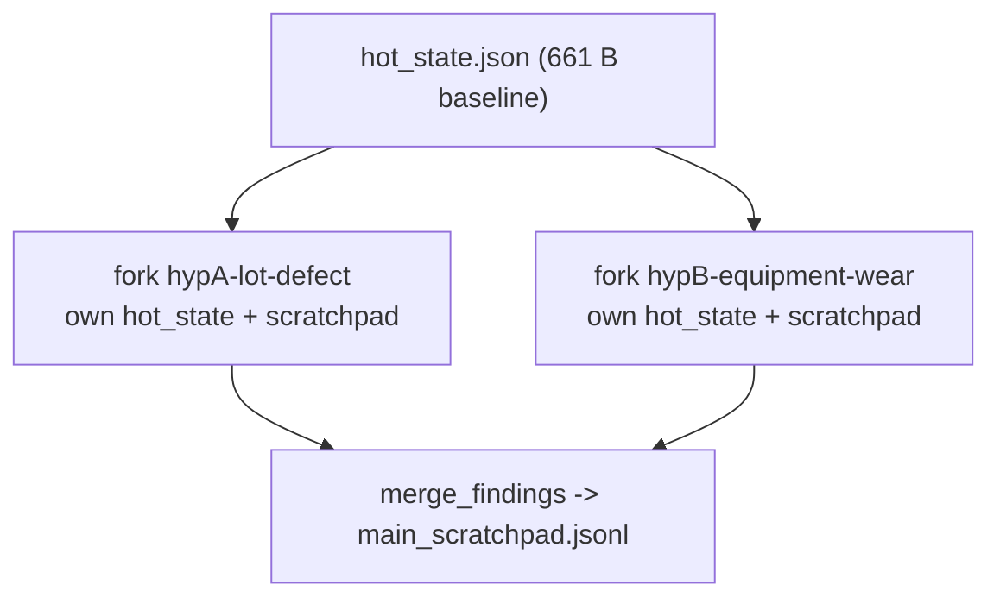

# Stand-out 3 — Fork path end-to-end (System 4)

Exercised System 4's fork-and-scratchpad path against the *real* hot state produced by the
graded run (`../evidence/system-4-shift/hot_state.json`, 661 B). Offline, no API.
Script: `fork-demo/run_fork_demo.py`; output: `fork-demo/stdout.log` + `fork-demo/work/`.

## Scenario — two competing hypotheses for the capacitor-bank-C-7 cluster

- **hypA-lot-defect** — the 5 defects all trace to lot 2026-0430-B (DAR 0.39, ESR ~19 mOhm):
  a dielectric/impregnation defect confined to one lot; quarantine + retest.
- **hypB-equipment-wear** — bank C-7 shows 15/17 defects on night shift over 60 days across
  multiple lots: an equipment/thermal factor, not a lot; PM inspection + thermal logging.

Both are plausible from the same `active_alerts` in the hot state, so they are investigated in
parallel forks rather than serially in one polluted context.

## Mechanism (from `shift_monitor/fork.py` + `scratchpad.py`)

`fork_for_hypothesis(base_hot_state, hyp_id, forks_root)` copies the shared baseline hot state
into `forks/<hyp_id>/hot_state.json`, giving each hypothesis the same starting point but an
isolated working dir. Each fork appends **only its own** `ScratchpadEntry` to its local
`scratchpad.jsonl`. `merge_findings(...)` then folds both isolated scratchpads into the main stream.



## Isolation proof (from `stdout.log`)

```
hypA-lot-defect: entries=['hypA-lot-defect'] isolated=True baseline_copied=True
hypB-equipment-wear: entries=['hypB-equipment-wear'] isolated=True baseline_copied=True
main after merge: ['hypA-lot-defect', 'hypB-equipment-wear'] (count=2)
RESULT: isolation_ok=True merge_ok=True
```

- Each fork's `scratchpad.jsonl` (`fork-demo/work/forks/<hyp>/scratchpad.jsonl`) contains exactly
  one entry — its own hypothesis, never the other's. No cross-contamination.
- Each fork received its own copy of the baseline `hot_state.json` (shared starting point,
  independent evolution).
- Only after the investigations complete does `main_scratchpad.jsonl` collect both findings
  (count=2), so the main stream stays clean until an explicit, controlled merge.

This is the Layer-3 orchestration payoff: two speculative investigations run without polluting
each other or the durable shift state, and the harness reconciles them deterministically.
